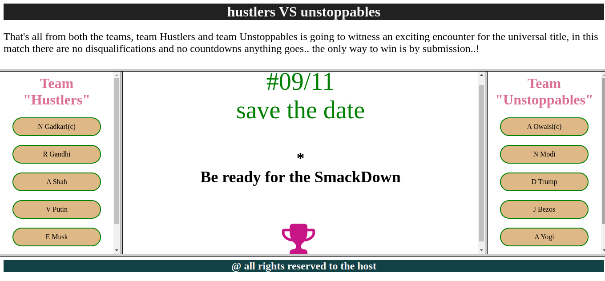

# HTML and CSS Basics: A Practical Guide

This repository is designed to provide you with hands-on experience in creating dynamic and visually appealing web content 
using HTML and CSS.

## Table of Contents

1. [Introduction to HTML and CSS](#introduction-to-html-and-css)
2. [Basic HTML Concepts](#basic-html-concepts)
3. [Basic CSS Conceptsz](#basic-css-concepts)
4. [Bikes Website](#https://github.com/kapil-malviya/HTML-CSS/tree/main/static%20website)
5. [Frameset Project](#https://github.com/kapil-malviya/HTML-CSS/tree/main/frameset)
6. [Contributing](#contributing)


## Introduction to HTML and CSS

Get started with the basics of HTML and CSS. Learn how to structure web content using HTML and style it using CSS. 
Understand the relationship between these two core technologies that form the backbone of modern web development.

## Basic HTML Concepts

Explore essential HTML elements and tags for creating the structure of web pages. Learn about headings, paragraphs, 
lists, links, images, forms, and more. Master the art of structuring content effectively.

## Basic CSS Concepts

Dive into the world of CSS and discover how to style your HTML elements. Learn about selectors, properties, values, 
colors, typography, margins, padding, and more. Enhance the visual appeal of your web pages with custom styles.

## Bikes Website

Build a simple yet engaging website for showcasing bikes. Apply your HTML and CSS skills to create a visually appealing 
website that features images, descriptions, and details of various bike models. Learn how to create responsive layouts 
and design elements.


## Frameset Project

Explore the concept of framesets in HTML by creating a practical project. Learn how to divide a web page into multiple 
frames, each displaying different content. Build an interactive frameset-based project that demonstrates your understanding 
of this classic web layout technique.




## Contributing

We welcome contributions to this repository! If you find any errors, want to enhance explanations, or have additional 
examples to share, please submit pull requests. Your contributions will help enrich the repository's content and benefit 
fellow learners.


## Get Started

To begin your journey with HTML and CSS, clone this repository to your local machine:

```
git clone https://github.com/kapil-malviya/HTML-CSS.git
```

Explore the different sections, follow the tutorials, and experiment with the provided code examples. By the end of your 
exploration, you'll have a solid grasp of HTML and CSS concepts, along with the ability to create engaging web content.
